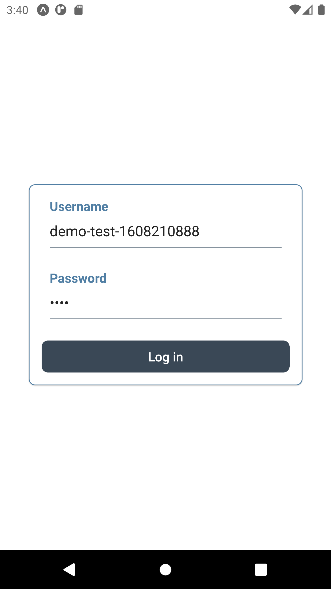
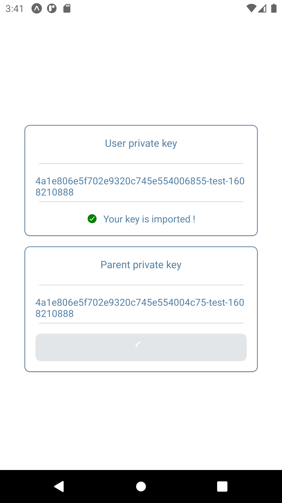
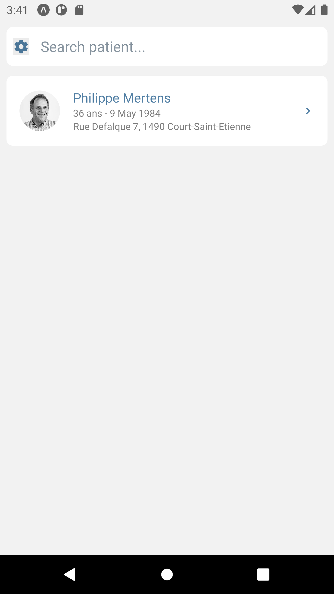
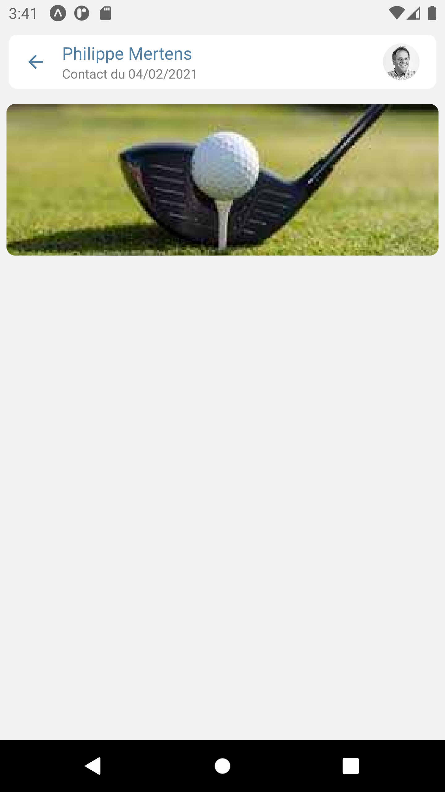
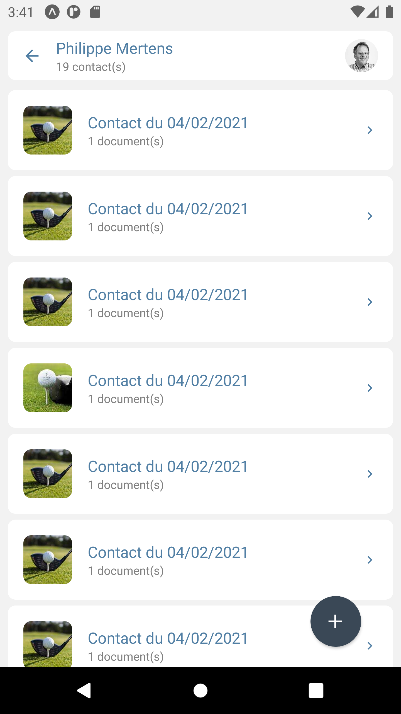
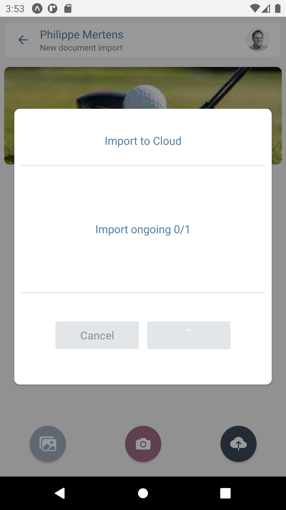

# icure-scan : A first step towards Mobile Companionship to iCure Stack

React Native Mobile application able to consult or import image/scan from or into iCure patient file. Currently, the application supports:

1. User login
2. User Hcp and parent Hcp private key import
3. Patient accessLog direct search and display
4. Patient textual search based on the iCure `PatientByHcPartyNameContainsFuzzyFilter` filter
5. Patient file exploration. Only Contacts related to Service having (at least) the following

```
DOCUMENT_SERVICE_TAGS: CodeStub[] = [
{ code: 'document', id: 'CD-ITEM|document|1', type: 'CD-ITEM', version: '1' },
{ code: 'Plan', id: 'SOAP|Plan|1', type: 'SOAP', version: '1' }]
```

tags are taken into account. 6. Multi image (from the mobile Gallery or from its Camera) contact import 7. Image visualisation

## Next steps

See project issues.

## How to develop ?

Currently, the application runs in the Expo managed flow.

You can either run the application in a virtual device (we used Android Virtual Device) or your own device.

1. Currently the `BASE_URL` is hardcoded in `src/api/icure.tsx` with the IP 10.0.2.2 which allows you to address your machine localhost from an Android Virtual Device

2. Or you can make use of ngrok with your mobile phone. Yet, free ngrok plan are too limitating in term of allowed call by minutes for the application to work properly

Note on Android Virtual Device: make sure to use a PlayStore support free device and make sure to choose the "Software - GLES 2.0" emulated graphic performance option. If not, starting your virtual device might freeze your system (at least on Ubuntu 20.04).

The application expects three essential external entities from the iCure stack : the database, the backend and the icc-api.

### The database

The iCure stack database is a CouchDB instance wich is now interfaced with the latest backend version through the (fully!) reactive Krouch CouchDB driver (https://github.com/taktik/krouch).

In order to facilitate the development flow we can follow the following steps to get ready:

1. In your project directory, run

```
make run
```

Under the hood, this command will start a Docker container from a CouchDB 3 Docker image. Don't forget to create the \_user database. 2. To populate the database with the minimal required content, you can run the icc-api tests (with the icc-api/test/setup/setup.utils.ts) fully uncommented. There you will find the user, hcp and related keys required to get setup. The code is available from https://github.com/bspokeit/icc-api/tree/in_memory_localstorage_support (see below from more details about the icc-api).

### The backend

The application has been developed and tested together with the latest iCure backend version: the oss-kraken-3.0.0 (https://github.com/taktik/icure-backend/tree/release/oss-kraken-3.0.0).

Currently, the code base used comes from: https://github.com/bspokeit/icure-backend/tree/dev/icure-scan. There, a modification of the ContactController is used to avoid systematic empty result return from the service filtering (see: https://github.com/bspokeit/icure-backend/pull/1). This might be a consequence of a wrong filter usage from the frontend application or something else which is not yet clear (see: https://github.com/bspokeit/icure-scan/issues/10).

To run the backend

1. Import it as a standard project in IntelliJ
2. Comment out the publishing related task description in the build.gradle.kts file
3. Build the project. This step might be very resource demanding the first time (at least on Ubuntu 20.04). Using the command line helps in that respect (`./gradlew build`).
4. Run the project. In order to be aligned with the database container description above, you can use the follow JVM options:

```
-Dicure.authentification.local=true
-Dicure.couchdb.username=couch_user
-Dicure.couchdb.password=password
```

### The icc-api

The icc-api version compatible with the oss-kraken is the V4 version available here: https://github.com/taktik/icc-api/tree/release/v4.

#### Storage aspects

That being said, this version is currently suited for Web usage. In order to use it in a React Native context please refer to: https://github.com/bspokeit/icc-api/tree/in_memory_localstorage_support.

This branch provides an in-memory local storage support. Indeed, the icc-api required an access to a "storage". In a Web context, this storage will be provided by the browser `localStorage`. In a Mobile context, an alternative implementation should be provided. A React Native implementation based on the Expo `SecureStorage` might be a good way to go. Yet, the SecureStorage is asynchronous and the localStorage is synchronous.

The in-memory local storage solution provided in https://github.com/bspokeit/icc-api/tree/in_memory_localstorage_support (which might be merged in the master branch of the icc-api by the Taktik team in the future) do the job for now.

#### Cryptographic aspects

A key aspect of the iCure stack is the strong encryption support for all medical data.

In a Web context, the browser Web Cryto API support does the job. There is no such support in a React Native context.

There are two solutions (to our knowledge):

1. Use the `isomorphic-webcrypto` library which exposes the `mrscrypto` implementation in a React Native context (see: https://github.com/kevlened/isomorphic-webcrypto). Yet, the exposed `mrscrypto` version does not support concurrent crypto function calls (see: https://github.com/kevlened/isomorphic-webcrypto/issues/37). And, as a matter of fact, on one hand the icc-api naturally use concurrent calls and on the other hand, your user interface might be such that concurrent calls occur (the user opens a patient file while a service attachment is being decrypted in the concurrent promise).

2. The second solution is simply the use of the latest `mrscrypto` version available at https://github.com/microsoft/MSR-JavaScript-Crypto. This version supports consurrencies since the 1.5 version.

The second solution is currently in used. The latest 1.6 `msrcrypto` library is present in the code (no npm package are yet available), it is secured at launch time as a SystemCheck and eventually injected in the icc-api.

## Screen preview







